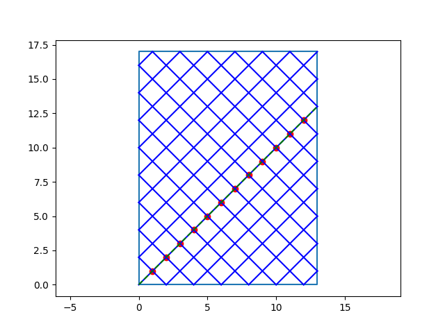

# [Billiard](Billiard/billiard.pdf)

**Usage**

```
>> python billiard.py <m> <n> <px> <py> <qx> <qy>
```

The program simulates a ball bouncing on a rectangular billiard
table with only corner pockets and sides of integer lengths m
and n (with m and n relatively prime). A ball sent at a 45 degrees
angle from a corner will be pocketed in another corner after m + n - 2 bouncing. 
The program also computes the number of intersections between ball path and
line segment PQ.



