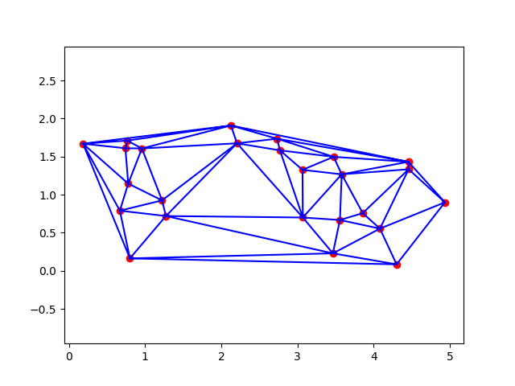

# [Delaunay Triangulation](delaunay/Delaunay.pdf)


**Usage**

```
>> python delaunay.py <coordinates_filename>
```

This program computes the [Delaunay triangulation](https://en.wikipedia.org/wiki/Delaunay_triangulation) 
of a given set of points.




