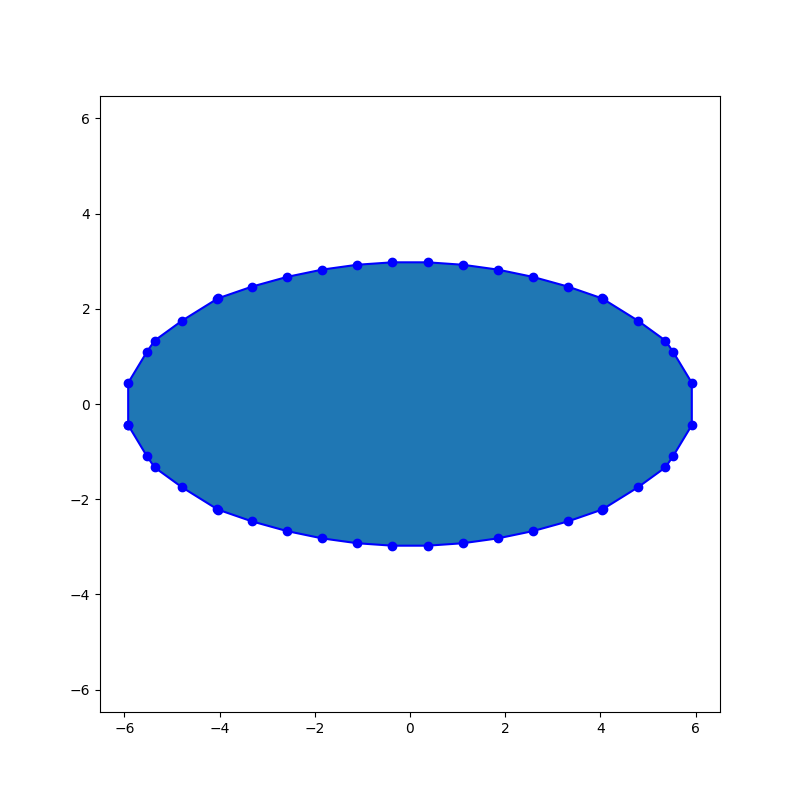
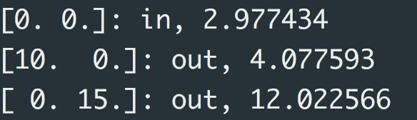

# [Shape Processing](project/project-new.pdf)

## 1. Whole Pipeline

**Usage**

```
>> python shape_processing.py <expression_file> <points_file>
```


## 2. Reconstruction

**Usage**

```
>> python reconstruction.py <expression_file>
```


## 3. Point Membership Check

**Usage**

```
>> python pmc.py <polygon_file> <points_file>
```


## 4. Polygon Triangulation

**Usage**

```
>> python triangulation.py <polygon_file>
```


## 5. Medial Axis

**Usage**

```
>> python medial_axis.py <polygon_file>
```

