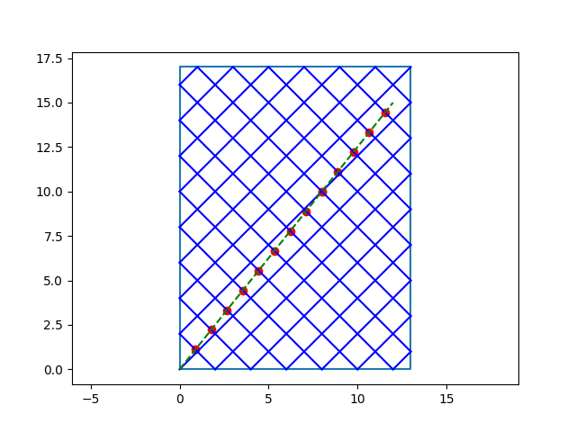
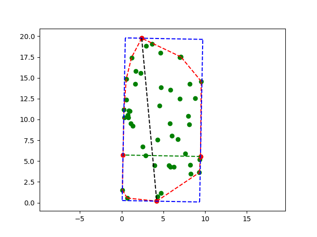
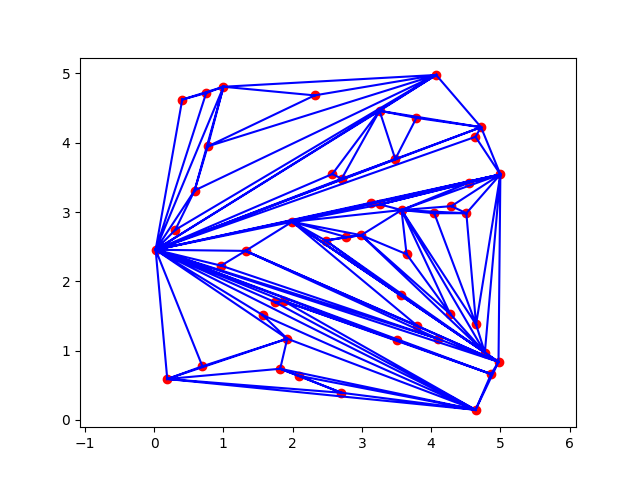
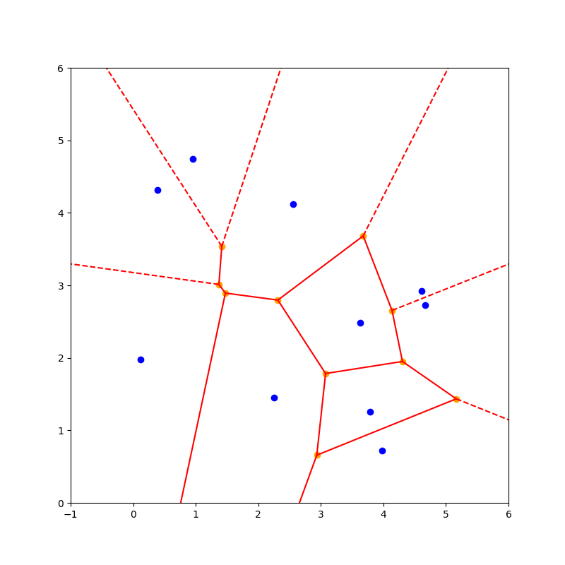
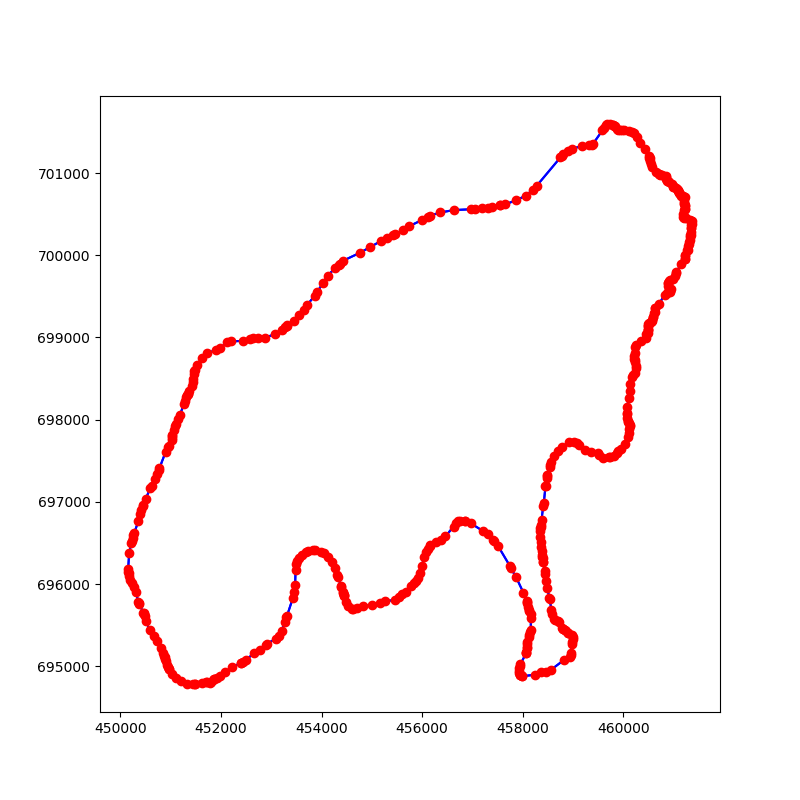
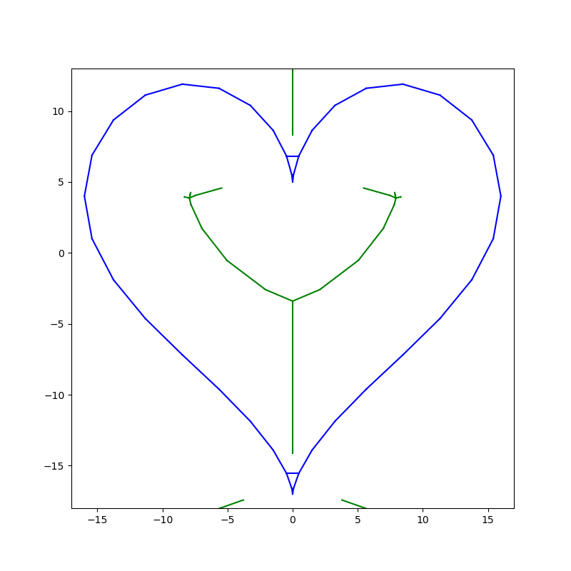
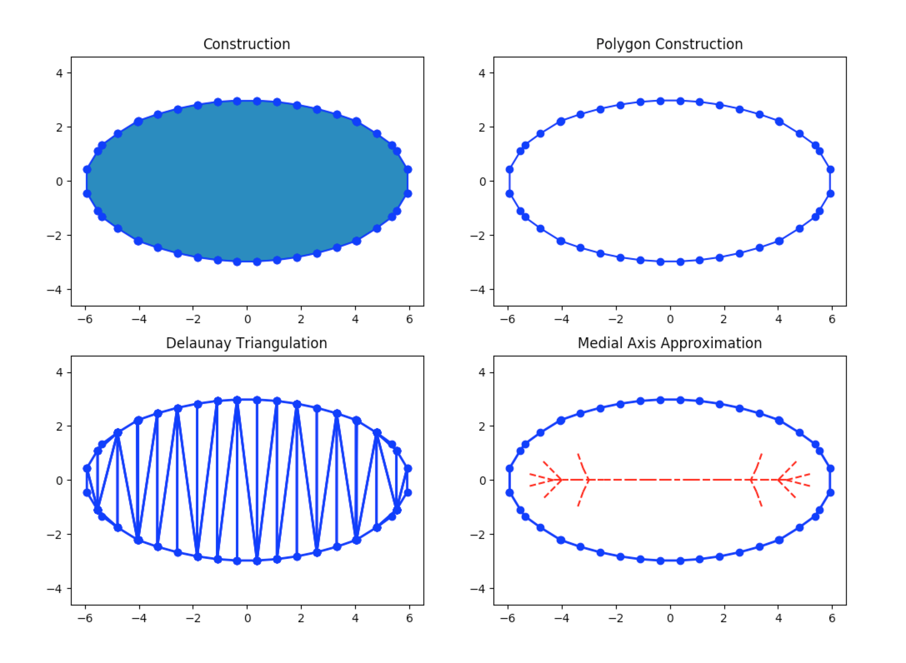
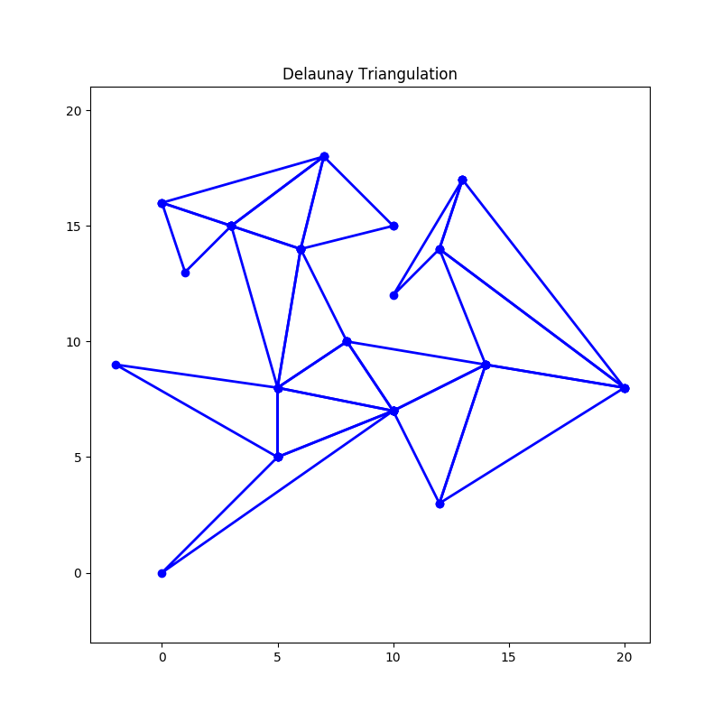
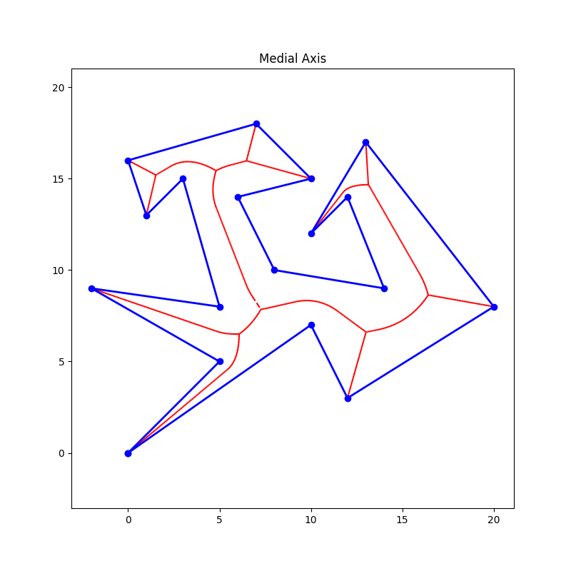

# Computational Geometry
This repository includes python implementation of some
computational geometry algorithms including line intersection, convex hull, polygon diameter/width, triangulation, Delaunay triangulation, Voronoi diagram, shape reconstruction, marching squares, polygon Delaunay triangulation, medial axis of polygon.

1. [Line](HW/hw1/README.md)

2. [Convex Hull, Diameter and Width](HW/hw2/README.md)

3. [Triangulation](HW/hw3-1/README.md)

4. [Delaunay Triangulation](HW/hw3-2/README.md)

5. [Voronoi Diagram and Shape Reconstruction](HW/hw4/README.md)

6. [Marching Squares, Point Membership Check, Polygon Triangulation, Medial Axis](HW/project/README.md)

